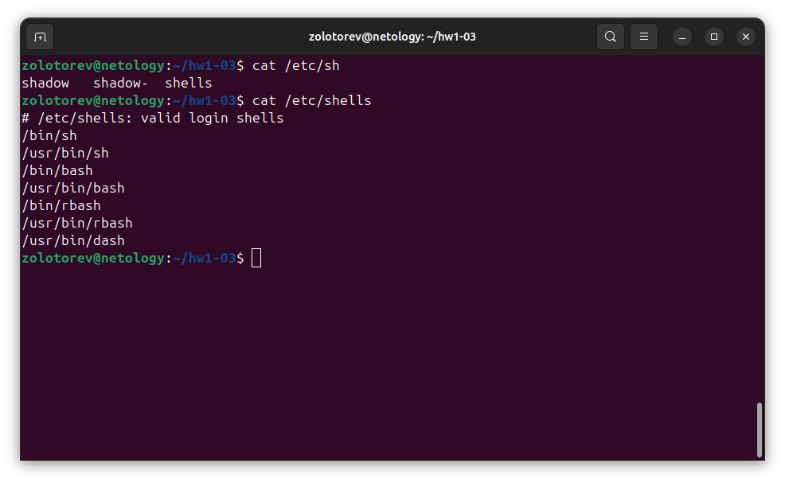
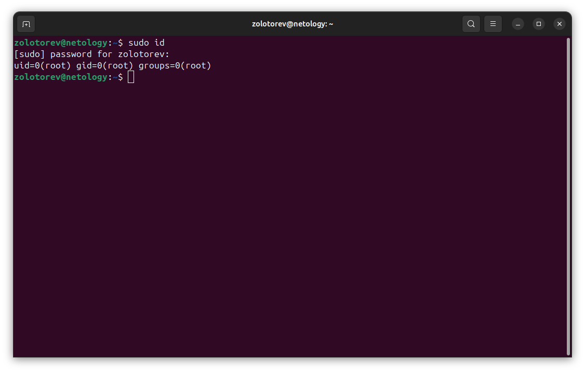

# Домашнее задание к занятию "Знакомство с операционной системой Linux"
### Золоторев Н.Д.

### Задание 1

    Подготовьте рабочее пространство:

    Скачайте с сайта VirtualBox и установите на свой компьютер
    Создайте новую виртуальную машину
    Скачайте Ubuntu
    Установите Ubuntu на вашу виртуальную машину

Примечание: Если у вас операционная система macOS или Linux, воспользуйтесь инструкцией.

Сделайте скриншот консоли, где в строке ввода будет ваше ФИО.

### Задание 2

Запустите терминал и выполните команды:

    echo $SHELL
    cat /etc/shells

Ответ приведите в виде снимка экрана и прокомментируйте в свободной форме результаты выполнения указанных команд

### Задание 3

Установите при помощи утилиты apt файловый менеджер mc.

Решение приведите в виде последовательности команд или снимка экрана

### Задание 4* (необязательно выполнение)

Его выполнение необязательное и не влияет на получение зачёта по домашнему заданию. Можете его решить, если хотите лучше разобраться в материале.

Выполните следующие команды:

    id
    sudo id

Объясните, почему вывод одной и той же команды отличается в этих случаях.

### Задание 1

### Задание 2

Команда echo $SHELL используется для отображения значения переменной окружения SHELL, которая содержит путь к исполняемому файлу оболочки (например, Bash, Zsh и т.д.). Когда мы вводим эту команду в терминале, она выводит путь к нашей текущей оболочке. Эта команда полезна для проверки, какая оболочка используется в данный момент. Например, если мы используем Bash, результат будет выглядеть так:

Команда cat /etc/shells в Linux выводит содержимое файла /etc/shells, который содержит список допустимых оболочек (shell) для пользователей системы. Этот файл обычно используется для определения, какие оболочки могут быть назначены пользователям при их создании.

### Задание 3

sudo apt install mc

mc

### Задание 4

Команда id отображает информацию о текущем пользователе, выполняющем команду. Она предоставляет такие данные, как UID (идентификатор пользователя), GID (идентификатор основной группы) и список дополнительных групп, к которым принадлежит пользователь. 

Команда sudo id выполняет id с повышенными привилегиями, используя sudo. Это значит, что если мы вводим sudo id, команда будет выполнена от имени пользователя root (или другого пользователя, если указано через опцию -u). Таким образом, мы получим информацию о пользователе root (или указанном пользователе), включая его UID и группы.

